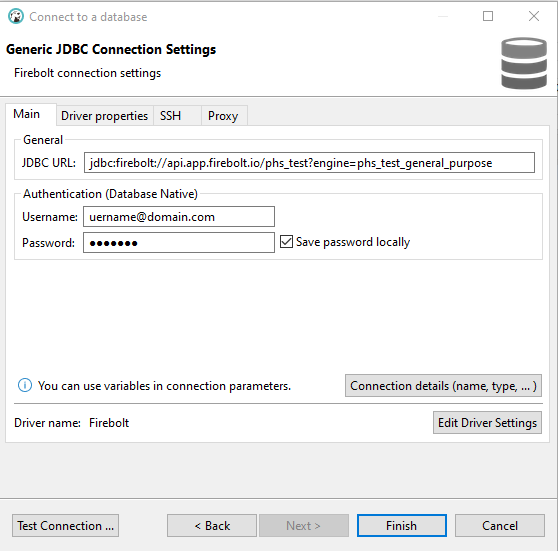
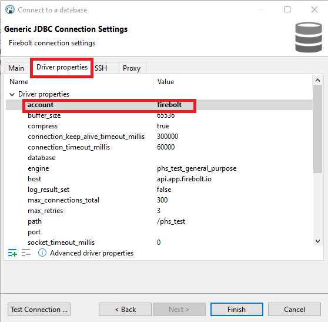

# Connect to DBeaver
{: .no_toc}

DBeaver is a free open-source administration tool used to simplify working across a range of different database types. DBeaver can connect to Firebolt databases using the JDBC driver.

1. Topic ToC
{:toc}

## Adding driver configuration in DBeaver

- Download the [Firebolt JDBC driver](../developing-with-firebolt/connecting-with-jdbc.md#downloading-the-jdbc-driver).

- From the top navigation menu choose **Database** > **Driver Manager**.

- In **Driver Manager**, choose **New**.

- Enter parameters according to the following guidelines:
   * Driver Name: `Firebolt`.
   * Class Name: `com.firebolt.FireboltDriver`.
   * Under **Libraries**, choose **Add File**, and then choose the JDBC driver you downloaded.

- Choose **OK**.

## Adding a database in DBeaver

1. From the top navigation menu, choose **Database** > **New Database Connection**.  

2. Type `Firebolt` in the search box, and then select it from the list of databases.  

3. Choose **Next**.  

4. Enter parameters according to the following guidelines:

| Parameter    | Required | Description                                                                                                                                                                                                                                                                                                                                                                                                                                                                                |
|:-------------|:---------|:-------------------------------------------------------------------------------------------------------------------------------------------------------------------------------------------------------------------------------------------------------------------------------------------------------------------------------------------------------------------------------------------------------------------------------------------------------------------------------------------|
| **JDBC URL** | yes      | Use the following URL: `jdbc:firebolt:<database_name>`     In the path above, be sure to replace `<database_name>` with the name of your Firebolt database. This enables you to query the database using its default engine.     If you wish to use a different engine than the default, use the following URL: `jdbc:firebolt:<database_name>?engine=<engine_name>`    In the path above, replace `<engine_name>` with the name of the engine you would like to use. |
| **Username** | yes      |                                                                                                                                                                                                                                                                                                                                                                                                                                                                                            | Your Firebolt client ID.                                                                                                                                                                                                                                                                                                                                                                                                                                                                   |
| **Password** | yes      | Your Firebolt client secret.                                                                                                                                                                                                                                                                                                                                                                                                                                                               |
| **account**  | yes      | If the user has access to multiple accounts, set the account under Driver Properties to the account name to which the engine belongs.                                                                                                                                                                                                                                                                                                                                              |
| **engine**   | no       | The name of the Firebolt engine to use. If omitted, the default engine attached to specified database will be used. Use name "system" to connect to system engine.                                                                                                                                                                                                                                                                                                                         |

Choose **Test Connection**. Make sure to start your database before you start the test and confirm the status is **Connected** as shown below.  

Choose **Finish**.

## Querying your Firebolt database

1. In the database navigator, right-click the database connection and choose **SQL Editor**. If a pop-up window appears, choose **New Script**.  

2. The SQL editor opens where you can run queries.

