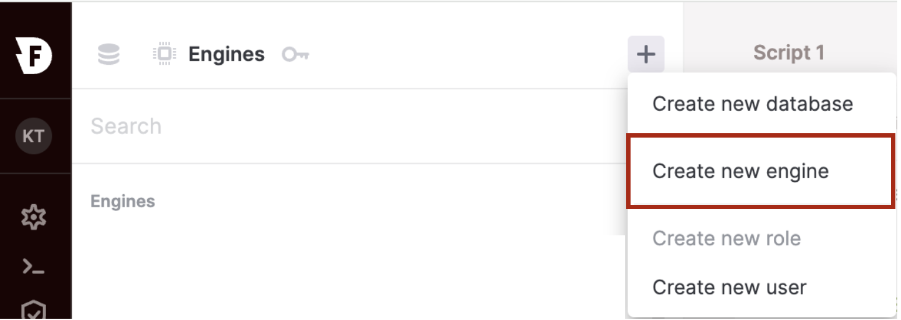
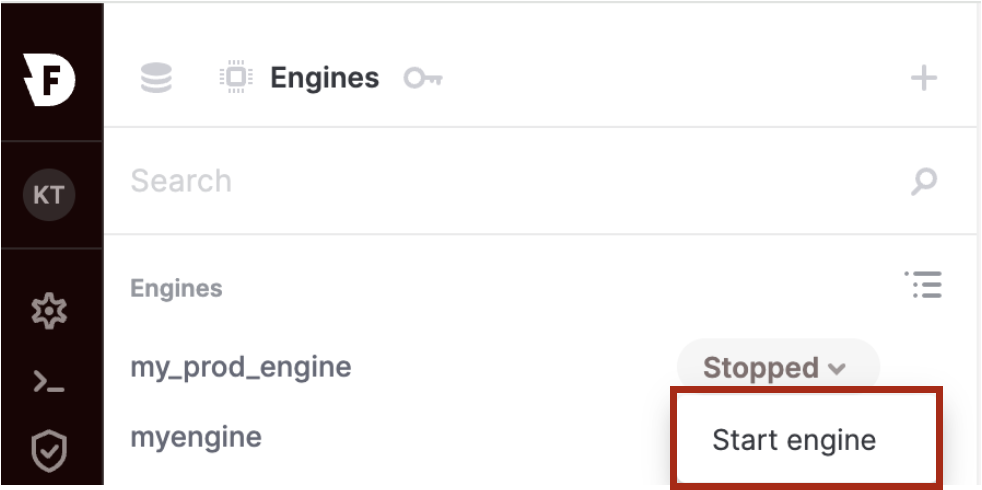
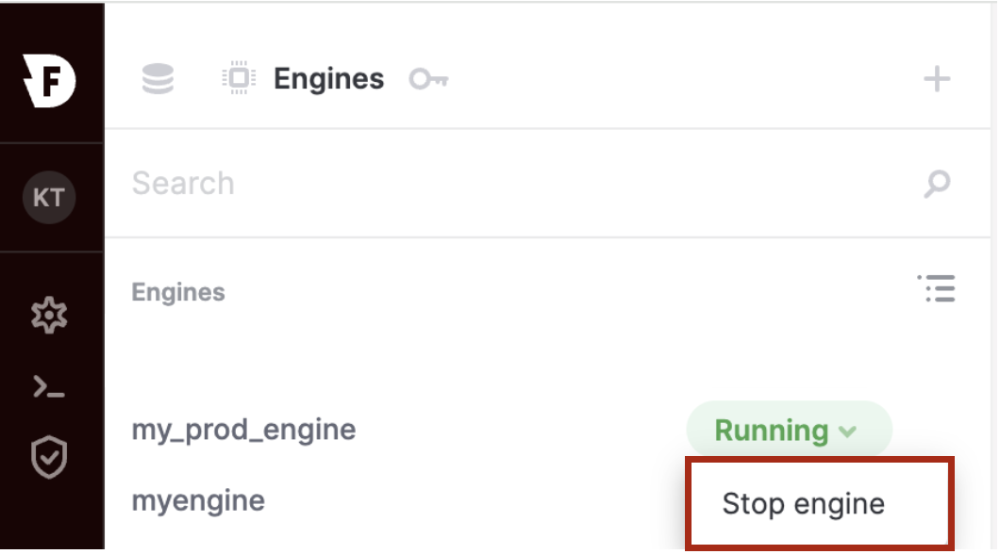
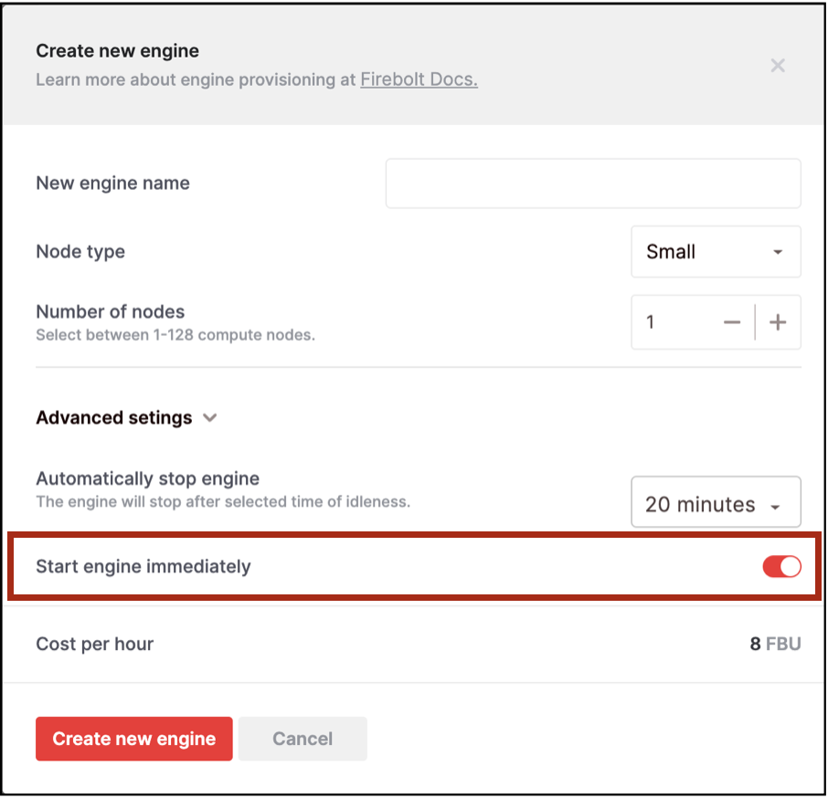
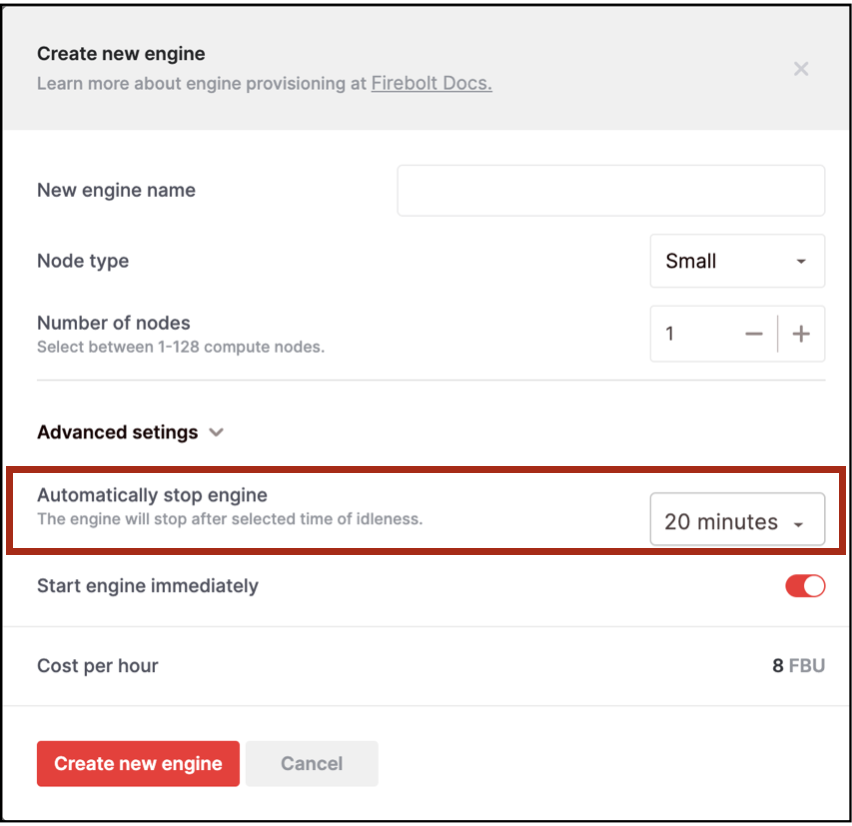

# Work with engines using DDL

You can create, run, and modify engines from the UI or using SQL API. Scaling operations on engines can be done dynamically without having to stop your engines. 

**TIP:** All the engine operations shown below can be performed via a System Engine.

# Create Engines
**UI** <br /> 
{: .fs-6}
1. Choose "Engines" <br />
{: width="600" .centered}
 <br /> 

2. Click the “+” sign and choose “Create new engine” <br />
{: width="600" .centered}
 <br /> 

3. Enter the engine name, type and number of nodes and click the "Create new engine" button <br />
{: width="600" .centered}
 <br />  

**API** <br /> 
{: .fs-6}
Use the [CREATE ENGINE](../../sql_reference/commands/engines/create-engine.md) command. <br />

The following statement creates an engine with one cluster that has two nodes of type 'S'.
```sql
CREATE ENGINE myengine;
```  

The following statement creates an engine with one cluster that has two nodes of type 'M'.

```sql
CREATE ENGINE myengine WITH
TYPE="M" NODES=2 CLUSTERS=1;
```  
<br />

{: .note}
Creating an engine (or any other Firebolt object) via UI preserves the case of the identifier used. For example, if you create an engine named ***MyEngine***, the uppercase letters in this identifier will be retained. When you use the identifier via a SQL command, to preserve case sensitive behavior you must enclose the identifier within quotes - in this case, "MyEngine". For more information on object identifiers, visit the [Object Identifiers](../../Reference/object-identifiers.md) section.


For more details with a full list of attributes and more example, see the [CREATE ENGINE](../../sql_reference/commands/engines/create-engine.md) command.
<br />

# Starting an Engine or Resuming a Stopped Engine
**UI** <br />
{: .fs-6}
From the list of engines, next to the engine that you want to start or resume, click the drop-down and select **Start engine**. <br />
{: width="600" .centered}
 <br /> 
Once the engine is started, the engine state will change to "Running".

**API** <br />
{: .fs-6}
Use the [START ENGINE](../../sql_reference/commands/engines/start-engine.md) command as show below:

```sql
START ENGINE myengine;
```  
<br />


# Stopping an Engine
**UI** <br />
{: .fs-6}
From the engines list, next to the engine that you want to stop, click the drop-down and select "Stop engine".
{: width="600" .centered}
 <br /> 

**API** <br />
{: .fs-6}
Use the [STOP ENGINE](../../sql_reference/commands/engines/stop-engine.md) command as shown below:

```sql
STOP ENGINE myengine;
```

By default an engine will wait for running queries to finish before stopping. To stop the engine without waiting for queries to finish, use `WITH TERMINATE=TRUE` as below:

```sql
STOP ENGINE myengine WITH TERMINATE=TRUE;
```

Note that stopping an engine results in emptying the cache. So, any queries after starting an engine that was previously stopped will have a cold start, resulting in some performance impact till the engine is warmed up again. 
<br />

# Resizing an Engine
**Scaling Up or Scaling Down** <br /> 
**UI** <br />
{: .fs-6}
You can dynamically scale up or scale down an engine by modifying the "Type" attribute of your engine. <br />
1. For the engine that you want to modify, hover next to the drop-down and click the ellipsis (three vertical dots). Then select “Modify engine".
{: width="600" .centered}
 <br /> 

2. Choose the appropriate Node type that you want and click the “Modify engine” button.
{: width="600" .centered}
 <br /> 

**API** <br />
{: .fs-6}
Use the [ALTER ENGINE](../../sql_reference/commands/engines/alter-engine.md) command, specifying the new node type (TYPE)  you want to use with your engine. For example, to scale up an engine from ‘S’ to ‘M’, you can use the following command:

```sql
ALTER ENGINE my_prod_engine SET TYPE = “M”;
```

Note that nodes across all the clusters in the engine will be switched to using the ‘M’ type node after the successful execution of the above command.


**Scaling Out or Scaling In** <br />
**UI** <br />
{: .fs-6}
You can dynamically scale out or scale in an engine by modifying the “NODES” attribute of your engine. <br />
1. For the engine that you want to modify, hover next to the drop-down and click the ellipsis (three vertical dots). Then select “Modify engine”.
{: width="600" .centered}
 <br /> 

2. Choose the appropriate “Number of nodes”  that you want and click “Modify engine”
{: width="600" .centered}
 <br /> 

 **API** <br />
 {: .fs-6}
 Use the [ALTER ENGINE](../../sql_reference/commands/engines/alter-engine.md) command, specifying the number of nodes (NODES) you want to use with your engine. For example, to scale out an engine from two nodes to three nodes, you can use the following command: 

```sql
ALTER ENGINE my_prod_engine SET NODES = 3;
```

Note that all the clusters in the engine will have three nodes after the above command completes successfully.

# Concurrency Scaling
You can use the “CLUSTERS” attribute of the engine to deal with concurrency scaling and increase or decrease the number of engine clusters as needed.

**Preview Limitations:** In preview, engines are limited to a single cluster. If you want to try multi-cluster engines, reach out to Firebolt Support.

Note that during resize operations, there may be an overlap when both old and new compute resources are concurrently running, consuming FBUs.


# Immediately Starting or Automatically Stopping an Engine
When you create an engine, you have the option to specify whether the engine should be automatically started after creation or whether you want to start the engine at a later time. In addition, you can also specify whether you want to automatically stop the engine after a certain amount of idle time. <br />

**UI** <br />
{: .fs-6}
Create new engine => Advanced Settings <br />
Turn off the “Start engine immediately" toggle if you don’t want the engine to be immediately started after creation. This option is turned on by default when you create an engine. 

{: width="600" .centered}
 <br /> 

 To specify whether you want the engine to be automatically stopped after a certain amount of idle time, use the “Automatically stop engine” setting and set the idle time. By default, this is set to 20 minutes. You can also set this to “Off” if you don’t want the engine to be automatically stopped.
{: width="600" .centered}
 <br /> 

 **API** <br />
 {: .fs-6}
 When you create the engine using the [CREATE ENGINE](../../sql_reference/commands/engines/create-engine.md) command, set the INITIALLY_STOPPED option to false if you want the engine to be started automatically after it is created.  To automatically stop the engine after a certain amount of idle time, use the AUTO_STOP option.

 The following example will create an engine that will not be immediately started. When you are ready to use the engine, you can start it with the [START ENGINE](../../sql_reference/commands/engines/start-engine.md) command. Since the AUTO_STOP option is set to 10 minutes, the engine will be automatically stopped after it has been in an idle state for 10 minutes.
 
 ```sql
CREATE ENGINE my_prod_engine WITH 
INITIALLY_STOPPED = true AUTO_STOP = 10;
```

You can also modify the AUTO_STOP of a running engine using the [ALTER ENGINE](../../sql_reference/commands/engines/alter-engine.md) command as shown in the example below:

```sql
ALTER ENGINE my_prod_engine SET AUTO_STOP = 30;
```

 **Note:** You can use the INITIALLY_STOPPED option only during engine creation. Once you create the engine, this option cannot be modified either via UI or API.


