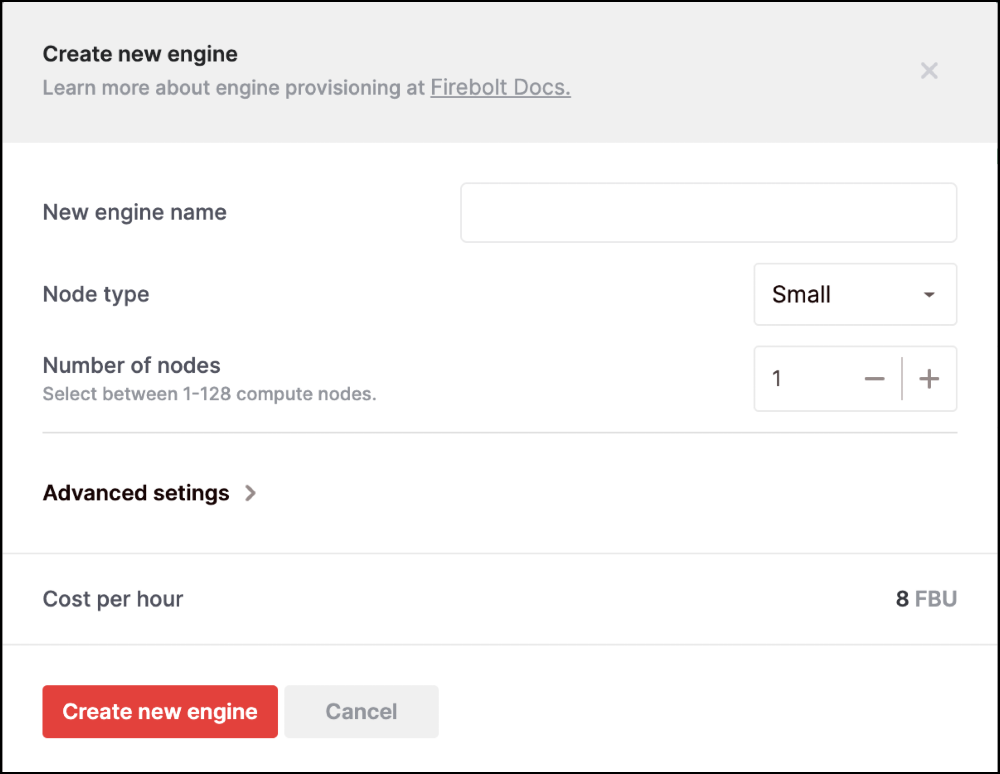

# Create Engines
## UI
1. Choose "Engines" <br />
  {: width="600" .centered}
 <br /> 

2. Click the “+” sign and choose “Create new engine” <br />
 {: width="600" .centered}
 <br /> 

3. Enter the engine name, type and number of nodes and click the "Create new engine" button <br />
{: width="600" .centered}
 <br />  

## API <br />
Use the [CREATE ENGINE](../../sql_reference/commands/engines/create-engine.md) command.

The following statement creates an engine with one cluster that has two nodes of type 'S'.
```sql
CREATE ENGINE MyEngine;
```  

The following statement creates an engine with one cluster that has two nodes of type 'M'.

```sql
CREATE ENGINE MyEngine WITH
TYPE='M' NODES=2 CLUSTERS=1;
```  

For more details with a full list of attributes and more example, see the [CREATE ENGINE](../../sql_reference/commands/engines/create-engine.md) command.

# Starting an Engine or Resuming a Stopped Engine
## UI
1. From the list of engines, next to the engine that you want to start or resume, click the drop-down and select **Start engine** <br />
{: width="600" .centered}
 <br /> 
Once the engine is started, the engine state will change to "Running"

## API
Use the [START ENGINE](../../sql_reference/commands/engines/start-engine.md) command as show below:

```sql
START ENGINE MyEngine;
```  


